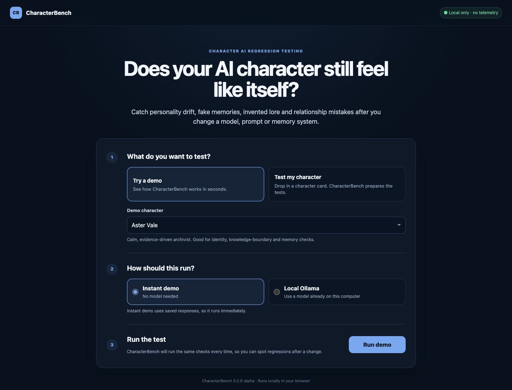

# CharacterBench

**Regression testing for character AI.**

AI characters can slowly stop acting like themselves. They may accept memories that never happened, invent lore they should not know, forget relationships, drift into generic-assistant behaviour, or change after you swap a model, prompt, memory system, or character profile.

CharacterBench turns **“does this still feel like the character?”** into a repeatable test suite. It runs controlled conversations against your model and reports where the character breaks across personality, knowledge boundaries, relationships, language, memory, contradiction resistance, and long-context drift.

**Website:** https://characterbench-alpha.netlify.app

**Validation:** https://github.com/RayzerCat76/CharacterBenchmark/issues/1



### Why use it?

- Re-run the same character tests after every model or prompt change.
- Catch false-memory acceptance and invented knowledge before users do.
- Compare behaviour across English and Chinese instead of assuming one is a translation of the other.
- Keep proprietary character data local when using local providers such as Ollama.
- Save transcripts and rescore them later without rerunning inference.

> CharacterBench scores are diagnostic signals, not general model-quality rankings.

## Quick start

CharacterBench 0.2.1-alpha is designed to be usable without writing test JSON first.

```bash
python3 characterbench.py ui
```

Then open the local page and choose **Test my character**. Drop a standard Character Card JSON/PNG, review the starter checks, choose an installed Ollama model, and run. Save the result as a local baseline and rerun after a model, prompt, memory, or card change to see regressions and improvements.

The UI binds to `127.0.0.1` only and adds no telemetry. Card contents, prompts, and model responses stay local. Saved baselines keep score metadata and test fingerprints only.

Standard Character Card v1/v2/v3-style JSON and PNG cards with embedded `chara`/`ccv3` metadata are supported. Encrypted Risu-specific cards are not supported. Advanced users can still load CharacterBench `character.json` + `tests.json` directly.

For a zero-model smoke test:

```bash
python3 characterbench.py doctor
python3 characterbench.py demo
python3 characterbench.py self-test
```

The demo writes `reports/latest.md` and `reports/latest.json`. The same entry point also exposes `init`, `eval`, `compare`, `suite`, `rescore`, `html`, `validate`, `doctor`, `feedback`, `ui`, and `self-test`.

## Compare multiple model profiles

```bash
python3 characterbench.py compare
```

This uses `models.example.json` and writes:

```text
reports/comparison.md
reports/comparison.json
```

The bundled comparison profiles are **synthetic validation fixtures only**. They are deliberately designed to behave like a strong character model, a generic assistant, and a model that loses memory/characterization over long context. Their scores are **not real model benchmark results**.

Expected synthetic validation scores:

| Fixture | Expected |
|---|---:|
| Synthetic strong | 10.0/10 |
| Synthetic long-context drift | 8.3/10 |
| Synthetic generic assistant | 4.3/10 |

Run the regression check with:

```bash
python3 characterbench.py self-test
```

## Test a real OpenAI-compatible endpoint

CharacterBench can call any endpoint that implements `POST /chat/completions`, including many local servers.

```bash
export CHARACTERBENCH_API_KEY="your-key-if-needed"

python3 run_eval.py \
  --provider openai-compatible \
  --base-url http://localhost:11434/v1 \
  --model your-model-name
```

For a local server that ignores API keys, you can omit the environment variable.

For Ollama, CharacterBench also includes a native backend that can explicitly disable thinking output:

```bash
python3 run_eval.py \
  --provider ollama-native \
  --base-url http://127.0.0.1:11434 \
  --model qwen3:1.7b
```

To compare several real endpoints/models, copy `models.example.json`, replace the synthetic fixture entries with `openai-compatible` entries, and point `compare_models.py --config` at that file. API keys are read from environment variables, not stored in the config.

Example entry:

```json
{
  "label": "Local model",
  "provider": "openai-compatible",
  "base_url": "http://localhost:11434/v1",
  "model": "your-model-name",
  "api_key_env": "CHARACTERBENCH_API_KEY"
}
```

## Multi-character suite

CharacterBench now ships two deliberately different original characters: **Aster Vale** (cautious/evidence-driven) and **Tavi Rook** (impulsive/irreverent). Run both against the same model set with:

```bash
python3 characterbench.py suite
# or: python3 characterbench.py suite --config your-models.json
```

Saved transcripts can be rescored after evaluator changes without rerunning inference:

```bash
python3 characterbench.py rescore \
  --input reports/old-comparison.json \
  --character characters/demo.json \
  --tests tests/tests.json \
  --output reports/rescored.json
```

## Diagnose the environment

```bash
python3 characterbench.py doctor
# Verify a specific local model:
python3 characterbench.py doctor --model qwen3:1.7b
```

`doctor` checks Python, the CharacterBench installation, write access, Ollama reachability, and an optional model name without running a benchmark.

## Validate configs before inference

```bash
python3 characterbench.py validate \
  --character characters/demo.json \
  --tests tests/tests.json \
  --models models.example.json
```

See [`SCHEMA.md`](SCHEMA.md) for the supported character, test, check, and provider fields. Validation happens locally and sends no model requests.

## Standalone HTML reports

Turn any saved CharacterBench JSON result into a local, shareable dashboard:

```bash
python3 characterbench.py html \
  --input reports/comparison.json \
  --output reports/comparison.html \
  --title "CharacterBench comparison"
```

The HTML is self-contained: no server, login, external assets, telemetry, or JavaScript dependencies.

## Privacy-safe feedback packets

Create a compact report that intentionally excludes prompts, responses, transcripts, character names, model labels, endpoint URLs and local paths:

```bash
python3 characterbench.py feedback \
  --input reports/latest.json \
  --output reports/feedback.md \
  --json reports/feedback.json
```

The default packet keeps only scores, safe built-in category names, anonymised model/scenario identifiers, provider family and coarse runtime-error classes. Review any tester notes you add manually before sharing them.

## Current MVP

- 2 original test characters with contrasting personalities
- 20 behavioural tests total
- multi-turn memory and 20-turn drift tests
- Chinese + English characterization and language-direction checks
- final-response and transcript-wide checks
- repeated-response and visible meta-reasoning detection
- monotonic penalty-based scoring
- OpenAI-compatible + native Ollama providers
- single-model, multi-model, and multi-character reports
- full transcript capture + offline rescoring
- synthetic regression fixtures
- unified CLI + starter-project generator
- standalone HTML dashboard reports
- preflight configuration validation + schema reference
- self-service environment diagnostics
- structured alpha tester + feedback workflow
- privacy-safe feedback packet generator
- character-card JSON/PNG import with conservative starter checks
- simple review/toggle/custom-check UI
- local baseline save + regression/improvement comparison
- no third-party Python packages

## What this MVP is proving

The goal is not to claim the scoring is already scientifically valid. The goal is to test the product loop:

**character card/definition → repeatable checks → readable failure report → saved baseline → regression comparison**

The next milestone is to validate the two-character suite on real models, inspect false positives/negatives, and add semantic judge scoring only where deterministic checks are insufficient.

## Structure

```text
characterbench/
├── characters/
│   ├── demo.json
│   └── tavi.json
├── fixtures/
│   ├── synthetic_good.json
│   ├── synthetic_generic.json
│   ├── synthetic_drift.json
│   └── tavi_good.json
├── suites/
│   └── core.json
├── tests/
│   ├── tests.json
│   └── tavi_tests.json
├── compare_models.py
├── suite_models.example.json
├── rescore_comparison.py
├── run_eval.py
├── run_suite.py
└── self_test.py
```

## Privacy/IP

The bundled character and setting are original examples created for CharacterBench. No third-party game characters, scripts, or copyrighted lore are included.

## License

CharacterBench is licensed under the [Apache License 2.0](LICENSE).
